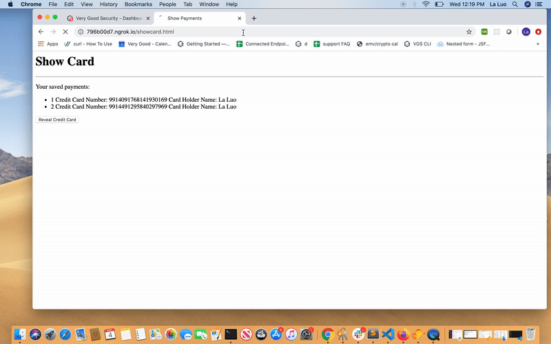
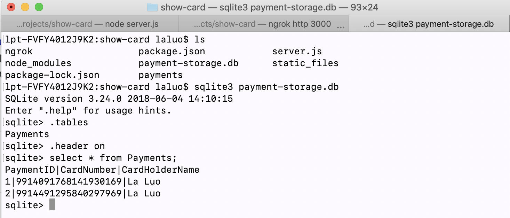
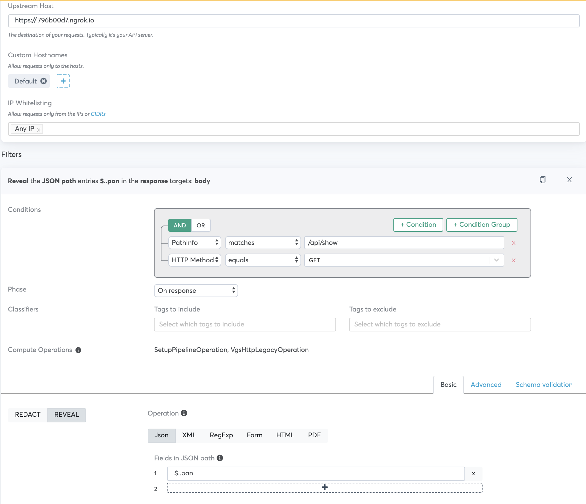

<p align="center"><a href="https://www.verygoodsecurity.com/"></a></p>
<p align="center"><b>Show Card with VGS Reverse Proxy</b></p>

# Instructions for using this App
This app demonstrates a use case using VGS reverse proxy to reveal card back to card holder.




## Run App
```
npm install
```
```
node server.js
```
You can check the portable database to see VGS tokens of pans are stored there. The alias format used here is `Payment Card - Prefixed, Luhn Valid, 19 Digits Fixed Length`

 

## Run Ngrok

./ngrok http 3000

## VGS Dashboard Route Config

 